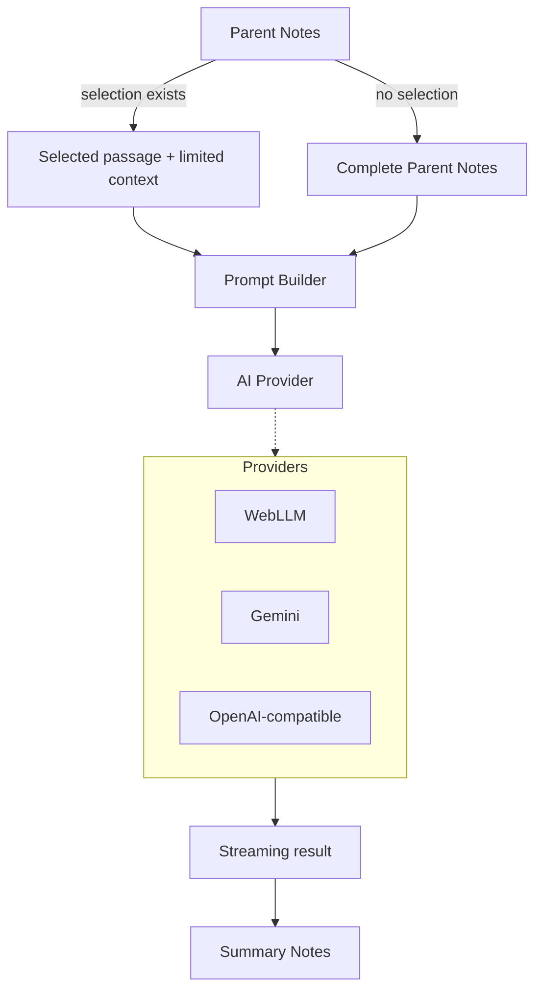

# Parallel Notes

> **Write · Import · Compress · Refine**

**Parallel Notes** is a privacy-first, browser-based study and revision workspace that turns long parent/source notes into concise, editable revision notes while keeping the original material intact.

## ✨ Features

- **Two-Pane Workflow:** Parent Notes → Summary Notes.
- **Rich-Text Editing:** Built using [Tiptap](https://tiptap.dev/).
- **AI Transformation:**
  - _Selection-based:_ If text is selected in the Parent Notes pane, only the selected passage is transformed.
  - _Full-document:_ If nothing is selected, the complete Parent Notes pane is summarized.
- **Multiple Output Modes:** Short Notes, Super-Short Notes, Structured Notes, Comparison, Concept / Flow, and Custom modes.
- **Source-Bound Prompting:** Designed to prevent unsupported facts and "helpful" expansion.
- **Progressive Output:** See results streaming while generation is running.
- **Red Stop Control:** Preserves partial output if stopped mid-generation.
- **Local & Cloud AI Options:**
  - **Local WebLLM Inference:** Lightweight curated local models (e.g., `Qwen2.5-1.5B-Instruct-q4f16_1-MLC`, `Llama-3.2-1B-Instruct-q4f16_1-MLC`, `Llama-3.2-1B-Instruct-q4f32_1-MLC`).
  - **Cloud APIs:** Gemini and OpenAI-compatible cloud APIs.
  - **Custom Endpoints:** Connect to your own OpenAI-compatible API endpoint.
- **Local Persistence:** Workspace documents are stored individually in IndexedDB; settings remain local to the browser.
- **Document Management:** Create, rename, delete, and manage active documents. Generating documents are highlighted and promoted to the top of the list.
- **Export Capabilities:** Export and clipboard support for easy sharing.
- **Static Architecture:** GitHub Pages/static-hosting friendly. No Node.js runtime or backend server required.

---

## 📥 Document Import & 📤 Export

### Document Import

- **PDF Import:** Import searchable PDFs directly into a new Source document.
- **DOCX Import:** Import Word `.docx` documents into a new Source document using Mammoth for semantic Word-to-HTML conversion.
- **DOCX structure preservation:** Word headings, paragraphs, lists, tables, emphasis, and links are converted into editor-ready HTML; embedded images are intentionally not persisted because the current editor does not use an image node.
- **Structure-aware extraction:** Reconstructs paragraphs, headings, lists, basic tables, emphasis, multi-column reading order, and common repeated headers/footers where detectable.
- **Hybrid option:** Standard extraction is deterministic and local. Enhanced Structure Assist can optionally use the currently selected AI model to classify ambiguous structure while preserving extracted text as the source of truth.
- **Privacy:** Imported source files are processed temporarily in memory; only the resulting editor content is saved through the normal workspace persistence path. The PDF/DOCX file itself is not saved to workspace storage or intentionally placed in application caches.

### Document Export

Source and Result panes can be exported independently as real PDF or DOCX files. Export uses the current live editor content, including headings, lists, indentation, tables, rich text, and rendered LaTeX equations.

- **PDF Export:** Uses browser-faithful DOM rendering for consistent visual output. Large Source documents are no longer rendered into one giant canvas. Each A4 page is rasterized independently, avoiding browser canvas-dimension limits and reducing peak memory/CPU usage. Page boundaries prefer actual rendered text-line bottoms (line-safe pagination).
- **DOCX Export:** Creates a real editable Word document and embeds rendered equations where native Word equation conversion is not available in the browser. It uses a lightweight normalized HTML snapshot rather than cloning the full live editor DOM, and uses browser-resolved computed styles so paragraph/heading spacing, line height, font family/size, bold/italic runs, indentation, lists, and table formatting are preserved accurately.

---

## 🧠 AI Workflow

The Parent Notes pane is never replaced by AI output.



### Fact-Retention Lock (Source-Bound AI)

The AI layer uses a source-grounded compression contract rather than a generic summarization prompt. Before producing output, the model is instructed to internally audit retention of source-stated numbers, dates, proper nouns, Constitutional/legal references, committee and commission names/recommendations, Supreme Court/High Court judgments, examples, qualifiers, negations, chronology, and causal links. Outside knowledge, correction, updating, inference and gap-filling are explicitly forbidden.

The AI is instructed to use the supplied source as the factual authority. It should:

- Preserve meaning and important qualifiers.
- Preserve dates, numbers, names, institutions, laws, provisions, examples, classifications, and relationships present in the source.
- Remove repetition and low-information wording.
- Avoid unsupported facts and outside knowledge.
- Avoid correcting, researching, or expanding the source.
- Prefer deleting uncertain material over inferring it.

_The goal is compression, not research._

---

## 🔒 Privacy & Local AI

- **WebLLM:** When selected, inference runs locally in the browser using the downloaded model and WebGPU/WASM capabilities where supported.
- **Cloud Providers:** Cloud providers are optional. When selected, the relevant source text is sent to that provider according to its API behavior.
- **API Keys:** Stored locally when the user chooses to remember them. _Browser-local storage is convenient storage, not a secure secret vault._

### Storage and Cache

- **Workspace Data:** Workspace documents and settings are stored locally in the browser (IndexedDB).
- **Deletion:** Workspace deletion is intentionally separate from model-cache deletion.
- **Caches:** Service-worker caches are scoped to the application's own cache namespace.

---

## 🏗️ Detailed Architecture and Workflow

### Overview

Because the application is entirely static (HTML, CSS, Vanilla JS) without a backend, it emphasizes client-side processing, using IndexedDB for persistence and WebGPU/WASM via WebLLM for local AI generation.

The application follows a clean, modular structure using ES modules.

### Directory Structure and File-Level Breakdown

#### Root Files

- **`index.html`**: The main interface structure containing the UI layout, modal dialogs, and pane containers.
- **`sw.js`**: Service worker script for offline caching and Progressive Web App (PWA) capabilities.
- **`assets/js/app.js`**: The main entry point. It loads the global state from IndexedDB, creates the `AppUI` instance, initializes it, and registers the service worker.
- **`assets/js/config.js`**: Defines application-wide constants like `APP_VERSION`, `WORKSPACE_STORAGE_VERSION`, and allowed import origins.
- **`assets/js/ui.js`**: The `AppUI` class is the central orchestrator (Facade pattern). It binds all DOM events (sidebar toggle, mode picker, settings dialog), manages the layout (pane resizing via splitter), delegates logic to sub-controllers (documents, imports, exports, AI), and handles UI states like the progressive generation stream rendering.

#### Editor Subsystem (`assets/js/editor/` and `editor.js`)

- **`editor.js`**: Encapsulates the Tiptap rich-text editor setup.
  - Defines custom TipTap extensions for LaTeX math rendering (`MathInline`, `MathBlock` using KaTeX) and list indentation.
  - Constructs a responsive toolbar dynamically based on `TOOLBAR_ITEMS`.
  - Exposes public APIs like `createEditor`, `editorText` (for extracting plain text), `selectedText`, and `wordCount`.

#### Controllers (`assets/js/ui/`)

- **`document-controller.js` (`DocumentController`)**: Manages document CRUD and editor lifecycle.
  - Handles debounced autosaves when editors mark themselves as "dirty".
  - Reacts to `workspace-updated` events from other browser tabs (via BroadcastChannel) to warn the user or reload the workspace if changes occurred externally.
  - Renders the sidebar document list and handles renaming and deleting documents.
- **`import-controller.js` (`ImportController`)**: Manages the ingestion of external data.
  - Handles file uploads (PDF, DOCX) and URL imports.
  - Updates the modal UI states (progress bars, status text) dynamically.
  - Passes files to `ImportService` (which uses Mammoth for DOCX and PDF.js for PDFs) and handles "Enhanced Structure Assist" if an AI model is selected to aid PDF extraction.
- **`export-controller.js` (`ExportController`)**: Manages the UI and logic for exporting the current active Tiptap editor content to PDF (via html2pdf or native logic) or DOCX.
- **`settings-ui.js` / `ai-ui.js`**: Handle DOM interactions for the settings modal and the model picker dropdown.

#### AI Subsystem (`assets/js/ai/`)

- **`controller.js` (`AIController`)**: The orchestrator for AI operations.
  - Initializes the model registry, detecting WebGPU support to list available local models.
  - Downloads local models on demand (`loadSelectedModel`).
  - Provides `run` and `cancelGeneration` methods, bridging the UI's progress updates with the underlying `AIService`.
- **`ai-service.js`**: Contains the core logic to communicate with models. It formats the source text into the source-bound prompt using a Fact-Retention Lock.
- **`model-registry.js`**: Builds the list of available models, combining pre-configured cloud options (Gemini, OpenAI), local WebLLM models, and custom API endpoints provided by the user.
- **`providers/webllm.js`**: Wraps the MLC WebLLM library, exposing methods to check WebGPU, download model shards to browser cache, and run streaming inference.

#### Storage & Persistence (`assets/js/storage/`)

- **`workspace-store.js`**: The core data layer using IndexedDB.
  - Migrates legacy `localStorage` blobs to IndexedDB on first load.
  - Persists documents individually (`saveDocument`) and global workspace metadata (`saveWorkspaceMeta`).
  - Implements optimistic concurrency using a `revision` counter to detect cross-tab conflicts.
  - Uses `BroadcastChannel` to emit `workspace-updated` messages to sibling tabs.
- **`indexed-db.js`**: A lightweight Promise wrapper around the native IndexedDB API.
- **`settings-store.js`**: Saves non-critical user preferences (theme, API keys, AI settings) to standard `localStorage`.

### Application Workflow

1.  **Ingestion:** The user creates a new document or imports an existing PDF/DOCX/URL using the UI managed by `AppUI` and `ImportController`. Extracted HTML is injected into the Source pane (Tiptap editor).
2.  **Selection & Configuration:** The user highlights specific text in the Source pane or leaves it unselected. They select an output mode and an AI model.
3.  **Generation:** The `AIController` bundles the text and mode into a "source-bound prompt" and dispatches it via `AIService` to the chosen provider. For local WebLLM, it uses WebGPU to stream tokens locally.
4.  **Progressive Rendering:** As the provider streams markdown tokens back, `AppUI.queueProgressiveResult` catches them. A debounced render timer compiles the markdown fragment to HTML and injects it into the Result pane, creating a smooth typing effect.
5.  **Refinement:** The generated summary in the Result pane is fully editable. Autosave managed by `DocumentController` persists changes to IndexedDB.
6.  **Export:** The user can export the active pane to PDF or DOCX via the `ExportController`.

### Storage and Cross-Tab Safety

Parallel Notes safely supports multiple tabs open simultaneously:

- Each write to IndexedDB bumps a `revision` number in the `meta` store.
- Upon saving, `workspace-store.js` broadcasts this new revision number via `BroadcastChannel`.
- Background tabs receive this message. `DocumentController` intercepts it and prompts a workspace reload, updating the inactive tab's DOM to match the latest changes. If the inactive tab had unsaved changes, it throws a Conflict error, preventing silent overwrites.

---

## 🚀 Local Development & Deployment

### Local Development

Serve the project through an HTTP server during development rather than opening `index.html` directly with `file://`. This is important for browser modules, service workers, caching, and local WebGPU behavior.

```bash
# Example using Python
python -m http.server 8000

# Example using Node (npx)
npx serve .
```

### Deployment

Parallel Notes can be deployed as a static website, including GitHub Pages.

---

## 📊 Model Benchmarking

Parameter count alone should not determine the preferred model. For this application, benchmark:

- Model download size & Initial load time
- Cache load time
- First-token latency & Tokens/second
- Memory usage
- Compression ratio
- Fact preservation, Meaning preservation, & Qualifier preservation
- Hallucination rate
- Formatting consistency & Instruction adherence

_The best model is the one that compresses reliably while remaining fast enough for the target device._

---

## ✅ Testing Checklist

- [x] Full Parent Notes summarization works.
- [x] Selection-only summarization works.
- [x] Parent Notes remain unchanged.
- [x] Summary Notes remain editable.
- [x] Both panes survive reload.
- [x] Model loading percentage appears.
- [x] Output streams progressively.
- [x] Stop preserves partial output.
- [x] Failed generation shows a failed status.
- [x] Rename and delete work.
- [x] Generating document moves to the top and is highlighted.
- [x] WebLLM cache management does not delete workspace data.
- [x] Delete All Workspace Documents does not delete model cache.
- [x] Settings and API configuration remain intact after workspace deletion.

---

## 🕒 Recent Version History

### v0.10.1 — UX Improvements & Cross-Origin Editing

- **Document Deletion:** Deleting individual documents no longer triggers a warning.
- **Event Listeners:** Refactored event listener registration.
- **Cross-Origin Editing:** Added handshake feature and implemented `postMessage` architecture to support the "Edit in Parallel Notes" button.

### v0.9.x — Modularization & Export Upgrades

- **Export Redesign (v0.9.4):** Line-safe, page-by-page PDF renderer. DOCX exports use a lightweight normalized HTML snapshot with computed styles.
- **Workflow & Fixes (v0.9.3):** Restored v0.8 document workflow (recently modified docs rise to the top). Improved WebLLM compatibility preflight.
- **Modular Architecture (v0.9.1):** Transitioned to dedicated `DocumentController`, `EditorController`, `ImportController`, `ExportController`, and `AIController`.

### v0.8.0 — Storage & State Architecture

- Transitioned to IndexedDB workspace from legacy localStorage blobs.
- Implemented document-level autosave and multi-tab coordination (`BroadcastChannel`).

---

## 📄 License

See `LICENSE` for license terms.
