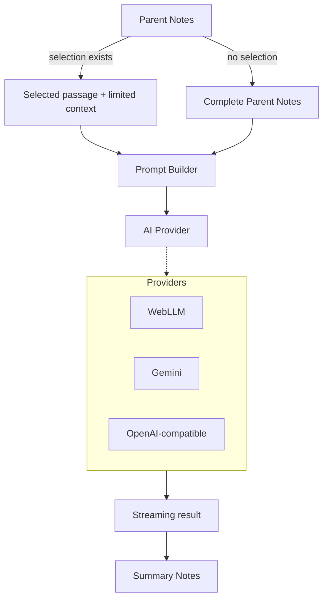

# Parallel Notes

> **Write · Import · Compress · Refine**

**Parallel Notes** is a privacy-first, browser-based study and revision workspace that turns long parent/source notes into concise, editable revision notes while keeping the original material intact.

## ✨ Features

- **Two-Pane Workflow:** Parent Notes → Summary Notes.
- **Rich-Text Editing:** Built using [Tiptap](https://tiptap.dev/).
- **AI Transformation:**
  - _Selection-based:_ If text is selected in the Parent Notes pane, only the selected passage is transformed.
  - _Full-document:_ If nothing is selected, the complete Parent Notes pane is summarized.
- **Multiple Output Modes:** Short Notes, Super-Short Notes, Structured Notes, Comparison, Concept / Flow, and Custom modes.
- **Source-Bound Prompting:** Designed to prevent unsupported facts and "helpful" expansion.
- **Progressive Output:** See results streaming while generation is running.
- **Red Stop Control:** Preserves partial output if stopped mid-generation.
- **Local & Cloud AI Options:**
  - **Local WebLLM Inference:** Lightweight curated local models (e.g., `Qwen2.5-1.5B-Instruct-q4f16_1-MLC`, `Llama-3.2-1B-Instruct-q4f16_1-MLC`, `Llama-3.2-1B-Instruct-q4f32_1-MLC`).
  - **Cloud APIs:** Gemini and OpenAI-compatible cloud APIs.
  - **Custom Endpoints:** Connect to your own OpenAI-compatible API endpoint.
- **Local Persistence:** Workspace documents and settings are stored locally in the browser.
- **Document Management:** Create, rename, delete, and manage active documents. Generating documents are highlighted and promoted to the top of the list.
- **Export Capabilities:** Export and clipboard support for easy sharing.
- **Static Architecture:** GitHub Pages/static-hosting friendly. No Node.js runtime or backend server required.

---

## 📥 Document Import (v0.7.0)

- **PDF Import:** Import searchable PDFs directly into a new Source document.
- **DOCX Import:** Import Word `.docx` documents into a new Source document using Mammoth for semantic Word-to-HTML conversion.
- **DOCX structure preservation:** Word headings, paragraphs, lists, tables, emphasis, and links are converted into editor-ready HTML; embedded images are intentionally not persisted because the current editor does not use an image node.
- **Structure-aware extraction:** Reconstructs paragraphs, headings, lists, basic tables, emphasis, multi-column reading order, and common repeated headers/footers where detectable.
- **Hybrid option:** Standard extraction is deterministic and local. Enhanced Structure Assist can optionally use the currently selected AI model to classify ambiguous structure while preserving extracted text as the source of truth.
- **Privacy:** The selected PDF is processed temporarily in memory. The PDF file itself is not saved to workspace storage or intentionally placed in application caches after extraction.
- **Scalable input layer:** Import is routed through a generic `ImportService`, so additional formats can be added without changing the document/AI workflow.
- **Privacy:** Imported source files are processed temporarily in memory; only the resulting editor content is saved through the normal workspace persistence path.

## 🧠 AI Workflow

The Parent Notes pane is never replaced by AI output.



### Source-Bound AI

The AI is instructed to use the supplied source as the factual authority. It should:

- Preserve meaning and important qualifiers.
- Preserve dates, numbers, names, institutions, laws, provisions, examples, classifications, and relationships present in the source.
- Remove repetition and low-information wording.
- Avoid unsupported facts and outside knowledge.
- Avoid correcting, researching, or expanding the source.
- Prefer deleting uncertain material over inferring it.

_The goal is compression, not research._

---

## 🔒 Privacy & Local AI

- **WebLLM:** When selected, inference runs locally in the browser using the downloaded model and WebGPU/WASM capabilities where supported.
- **Cloud Providers:** Cloud providers are optional. When selected, the relevant source text is sent to that provider according to its API behavior.
- **API Keys:** Stored locally when the user chooses to remember them. _Browser-local storage is convenient storage, not a secure secret vault._

### Storage and Cache

- **Workspace Data:** Workspace documents and settings are stored locally in the browser.
- **Deletion:** Workspace deletion is intentionally separate from model-cache deletion:
  - _Delete All Workspace Documents_ removes saved notes.
  - WebLLM model cache is managed separately.
- **Caches:** Service-worker caches are scoped to the application's own cache namespace.
- **Clear Site Data:** Using your browser's _Clear Site Data_ option is broader and can remove `localStorage`, `IndexedDB`, `Cache Storage`, service-worker data, and other site data depending on the browser.

---

## 🏗️ Architecture

```text
assets/js/
├── app.js
├── config.js
├── state.js
├── storage/
│   ├── workspace-store.js
│   ├── settings-store.js
│   └── credentials.js
├── editor/
│   ├── editor.js
│   ├── toolbar.js
│   └── selection.js
├── ai/
│   ├── ai-service.js
│   ├── controller.js
│   ├── model-registry.js
│   ├── source-package.js
│   ├── prompts.js
│   ├── stream.js
│   └── providers/
│       ├── webllm.js
│       ├── gemini.js
│       └── openai-compatible.js
├── services/
│   ├── markdown.js
│   ├── clipboard.js
│   └── export.js
└── ui/
    ├── ai-ui.js
    └── settings-ui.js
```

The application is intentionally modular while remaining a static HTML/CSS/JavaScript project.

### Technology Stack

- **Frontend:** HTML, CSS, JavaScript, [Tiptap](https://tiptap.dev/)
- **AI & Processing:** WebLLM, WebGPU/WASM, Gemini API, OpenAI-compatible APIs
- **Storage:** Browser local storage, Service Worker
- **Deployment:** GitHub Pages-compatible static hosting

---

## 🚀 Local Development & Deployment

### Local Development

Serve the project through an HTTP server during development rather than opening `index.html` directly with `file://`. This is important for browser modules, service workers, caching, and local WebGPU behavior.

```bash
# Example using Python
python -m http.server 8000

# Example using Node (npx)
npx serve .
```

### Deployment

Parallel Notes can be deployed as a static website, including GitHub Pages. _(See `docs/DEPLOY_GITHUB_PAGES.md` for deployment details if available)._

---

## 📊 Model Benchmarking

Parameter count alone should not determine the preferred model. For this application, benchmark:

- Model download size & Initial load time
- Cache load time
- First-token latency & Tokens/second
- Memory usage
- Compression ratio
- Fact preservation, Meaning preservation, & Qualifier preservation
- Hallucination rate
- Formatting consistency & Instruction adherence

_The best model is the one that compresses reliably while remaining fast enough for the target device._

---

## ✅ Testing Checklist

- [x] Full Parent Notes summarization works.
- [x] Selection-only summarization works.
- [x] Parent Notes remain unchanged.
- [x] Summary Notes remain editable.
- [x] Both panes survive reload.
- [x] Model loading percentage appears.
- [x] Output streams progressively.
- [x] Stop preserves partial output.
- [x] Failed generation shows a failed status.
- [x] Rename and delete work.
- [x] Generating document moves to the top and is highlighted.
- [x] WebLLM cache management does not delete workspace data.
- [x] Delete All Workspace Documents does not delete model cache.
- [x] Settings and API configuration remain intact after workspace deletion.

---

## 📄 License

See `LICENSE` for license terms.


## 📤 Document Export (v0.7.0)

Source and Result panes can be exported independently as real PDF or DOCX files. Export uses the current live editor content, including headings, lists, indentation, tables, rich text, and rendered LaTeX equations. PDF export uses browser-faithful DOM rendering for consistent visual output; DOCX export creates a real editable Word document and embeds rendered equations where native Word equation conversion is not available in the browser. DOCX export now uses the browser-resolved computed styles of the live Tiptap DOM so paragraph/heading spacing, line height, font family/size, bold/italic runs, indentation, lists, and table formatting are not reconstructed with a separate approximation layer.
